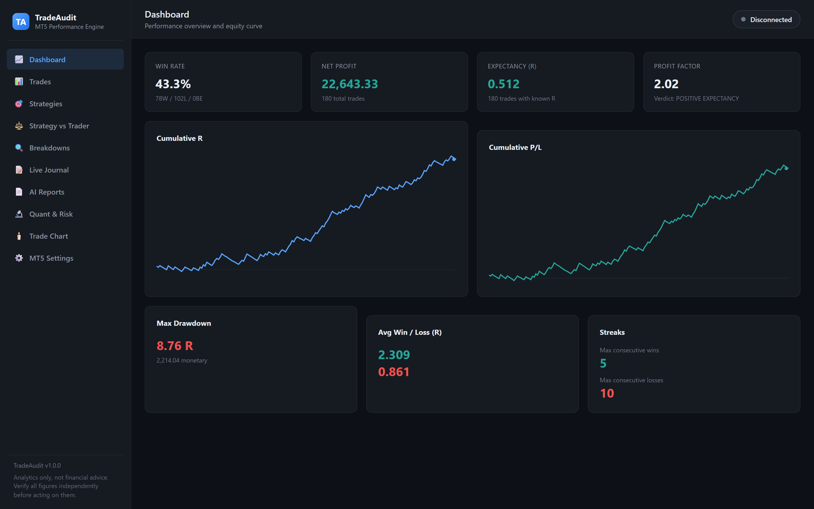
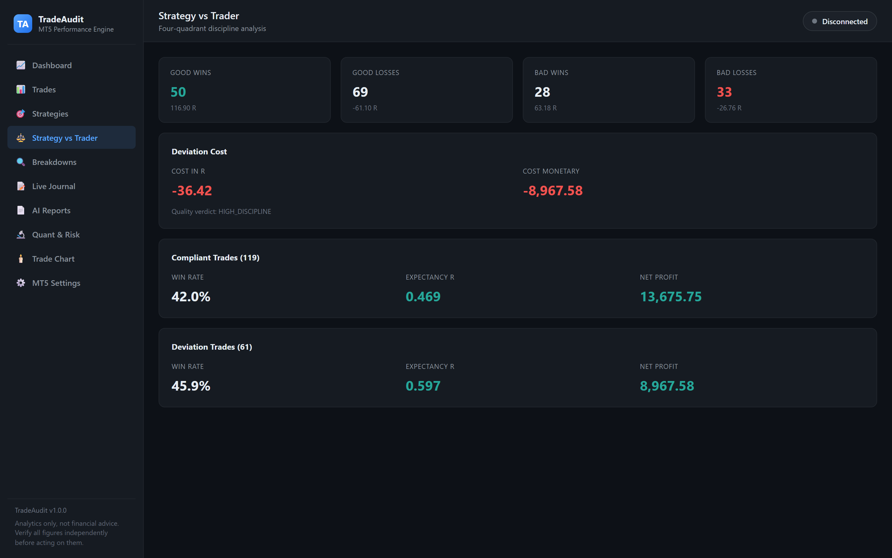
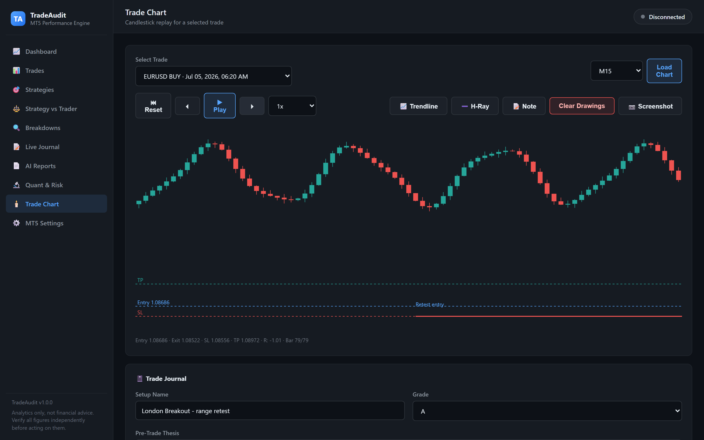
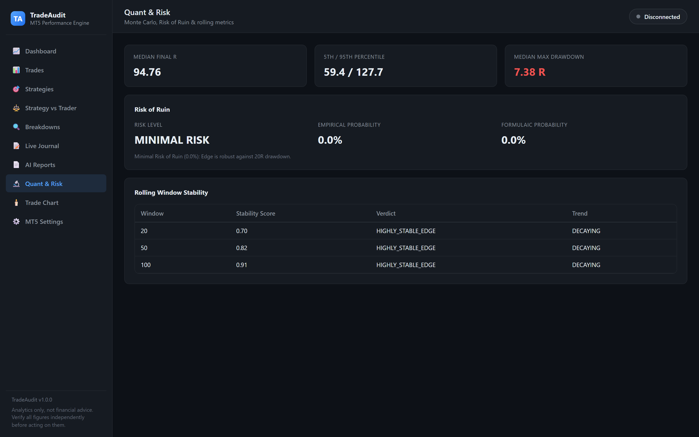
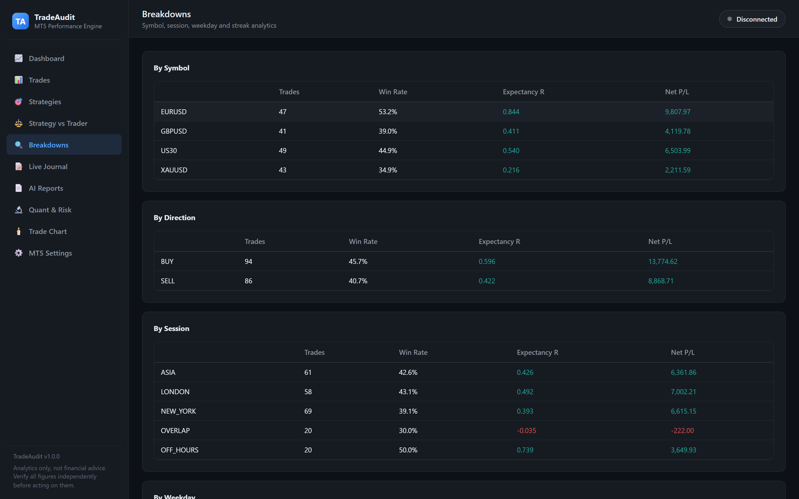
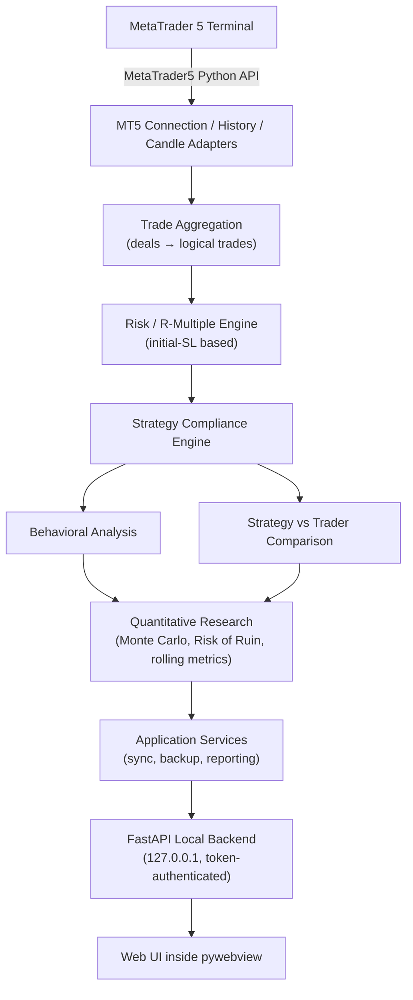

# ⚡ TradeAudit

[](https://github.com/Dev-Art-Solutions/TradeAudit/actions/workflows/ci.yml)
[](https://github.com/Dev-Art-Solutions/TradeAudit/actions/workflows/release.yml)
[](https://www.python.org/)
[](https://fastapi.tiangolo.com/)
[](https://pywebview.flowrl.com/)
[](https://www.sqlalchemy.org/)
[](https://microsoft.com/windows)
[](LICENSE)

TradeAudit is a production-oriented MetaTrader 5 trade auditing, risk
analytics, and behavioral intelligence platform built to answer two
separate questions: **does the strategy have an edge, and is the trader
executing that strategy correctly?**

Most trading journals stop at "you made $X this month." TradeAudit
reconstructs your trade history from real MT5 deal data, accounts for risk
in **R-multiples** rather than raw currency, separates **strategy quality**
from **execution quality**, flags emotional discipline breaks (FOMO,
revenge trading, risk escalation), and runs the same kind of quantitative
research (Monte Carlo, Risk of Ruin) a quant desk would run on a strategy's
trade log.



---

## 💡 The Core Problem TradeAudit Solves

1. **Does my strategy actually have a positive expectancy edge?**
2. **Am I executing the strategy rules with discipline?**
3. **How much R (risk units) do my execution mistakes and deviations cost me?**
4. **Are emotional impulses (FOMO, Revenge, Overtrading) draining my account?**

TradeAudit answers all four quantitatively and automatically, from your
real MT5 trade history.

---

## 🏗️ What This Project Demonstrates

- MetaTrader 5 API integration — connection lifecycle, history/candle
  reading, and reconciling MT5's deal/order data model into logical trades
- Risk-engineering domain modeling (R-multiples, initial-vs-trailed stop
  loss, deviation cost accounting)
- A rule-based strategy compliance engine
- Quantitative/statistical analytics in pure Python (Monte Carlo
  resampling, Risk of Ruin, bootstrap confidence intervals)
- A desktop-app-as-local-web-service architecture: FastAPI backend +
  HTML/CSS/JS frontend, hosted inside a native `pywebview` window
- Windows packaging: PyInstaller + Inno Setup, driven by a single
  `build.bat` and a tag-triggered GitHub Actions release pipeline
- Testing a desktop product with both unit tests and a real
  Playwright-driven browser end-to-end suite
- Finding and fixing real bugs by validating against a real MT5 account
  with thousands of real deals, not just green unit tests — see the
  [case study](PORTFOLIO_CASE_STUDY.md) for three concrete examples

---

## ✨ Key Features & Capabilities

### 📈 1. Performance Dashboard & Real-Time Analytics
- **Standardized R Accounting:** Realized R, Planned R:R, Win Rate, Expectancy (R per trade), Profit Factor, and Max Drawdown in R and currency.
- **Cumulative R & P/L Curves:** Equity curves, drawdown trajectories, and win/loss streak tracking.

### ⚖️ 2. Strategy vs Trader Analysis (The 4-Quadrant Matrix)
- **Quadrant Categorization:** Classifies trades into **Good Wins** (Compliant + Profitable), **Good Losses** (Compliant + Loss), **Bad Wins** (Deviation + Profitable), and **Bad Losses** (Deviation + Loss).
- **Deviation Cost in R:** Quantifies the exact statistical cost of breaking your rules.



### 🎯 3. Strategy Management & Compliance Engine
- Define custom strategies with explicit execution rules: Minimum R:R, Maximum Risk %, Allowed Symbols, Allowed Trading Sessions (Asia/London/NY), and Required SL/TP.
- Automatically audits historical trades against assigned strategies with clear compliance verdicts (`COMPLIANT`, `PARTIAL`, `DEVIATION`).

### 🧠 4. Behavioral & Emotional Trade Analysis
- Automated heuristics — each with a confidence level and an explicit reason, not a diagnosis:
  - 🚨 **Revenge Trading:** Rapid re-entries following losing trades.
  - 🌪️ **FOMO:** Chasing impulsive momentum without confirmed setups.
  - 📈 **Risk Escalation:** Unplanned position size inflation.
  - 🛑 **Stop-Loss Moving Away:** Widening risk mid-trade.
  - ⏱️ **Overtrading:** Exceeding disciplined daily trade limits.
- Supports emotional state tagging (`CALM`, `FEAR`, `GREED`, `FRUSTRATION`, `OVERCONFIDENCE`).

### 🕯️ 5. Interactive Candlestick Charts & Bar-by-Bar Trade Replay
- OHLC candlestick charting across multiple timeframes (**M1**–**D1**).
- **Execution Overlays:** Entry price, initial Stop Loss, and Take Profit rendered on the chart.
- **Replay Engine:** Step-by-step bar replay with speed control (0.5x–4x) to re-live execution dynamics.
- **Zoom & Pan:** Scroll to zoom into a cursor-centered window, drag to pan, one click to fit back to the full revealed range.



### 🎨 6. Chart Annotations, 1-Click Screenshots & Trade Review
- **Drawing Tools:** Trendlines, horizontal rays, rectangle zones, directional arrows, and text notes — anchored to price and timestamp, persisted per trade/timeframe.
- **1-Click Screenshot Capture:** Chart snapshots saved directly to disk and attached to the trade's journal entry, or copied straight to the clipboard.
- **Trade Review:** Pre-trade thesis, post-trade review, execution grading (A+ through F), and lessons learned.

### 📝 7. Live Trade Journal & Modification Tracking
- Real-time MT5 position polling that captures initial Stop-Loss and Take-Profit snapshots at the moment of order placement.
- Audit trail logging every mid-trade Stop-Loss and Take-Profit modification.

### 🔬 8. Quantitative Risk Research & Simulation
- **Monte Carlo Simulation:** Trade sequence reshuffling to discover worst-case drawdown distributions and percentile equity curves.
- **Risk of Ruin Calculation:** Empirical and formulaic probability of hitting a given drawdown threshold based on your actual edge.
- **Rolling Metrics & Bootstrap Confidence Intervals:** Rolling-window expectancy curves to measure edge stability over time.



### 🔍 9. Multi-Dimensional Breakdowns
- Performance sliced by symbol, direction, session (Asia/London/NY/Overlap), weekday, hour, streak, and emotion tag.



### 📄 10. Markdown & AI-Ready Reporting
- Export comprehensive audit dossiers ready for ChatGPT analysis with structured performance metrics, deviation breakdowns, and tailored diagnostic prompts — with one-click copy to clipboard.
- Built-in privacy controls: one-click account number and broker masking.

### 🔒 11. Security, Backups & Portability
- Passwords stored securely in the **Windows Credential Locker** via the `keyring` API (never logged or stored in plaintext).
- A per-session random token gates the local API, so no other process or webpage on the machine can drive the app without first loading its own UI.
- Automated SQLite backups (WAL mode, enforced foreign keys) with one-click restore.

---

## 🖥️ Architecture

The default UI is a **local web UI**: a FastAPI backend serving an
HTML/CSS/JS frontend, hosted inside a native `pywebview` window (no browser
chrome, no external server, nothing leaves `127.0.0.1`). A legacy PySide6
(Qt6) UI remains available via `--legacy-qt` — see
[docs/LEGACY_UI_STATUS.md](docs/LEGACY_UI_STATUS.md) for exactly what that
does and doesn't include today. Every analytics/sync/risk service is
UI-agnostic and shared by both.



---

## 📥 Download

Prebuilt Windows installers and portable ZIPs are published on the
[**Releases**](https://github.com/Dev-Art-Solutions/TradeAudit/releases)
page for every tagged version — no Python install required. Grab
`TradeAudit-Setup-vX.Y.Z.exe` (installer) or `TradeAudit-vX.Y.Z-win64-portable.zip`
(extract and run).

> The installer isn't code-signed yet, so Windows SmartScreen will show an
> "unrecognized publisher" prompt on first run — click **More info → Run
> anyway**. This is a known, tracked limitation, not a sign of a
> compromised build; the CI/release pipeline that produced it is public
> and auditable in this repository.

---

## 🚀 Quick Start (from source)

### Prerequisites
- **Windows 10 / 11** (64-bit)
- **Python 3.11+**
- **MetaTrader 5 Desktop Terminal** (optional — the app also runs against
  synthetic offline candle data for exploring the UI without a live account)

### Installation

```bash
git clone https://github.com/Dev-Art-Solutions/TradeAudit.git
cd TradeAudit

python -m venv .venv
.\.venv\Scripts\Activate.ps1

pip install -r requirements.txt
pip install -e .[dev]
```

### Launch

```bash
python -m tradeaudit              # web UI (default)
python -m tradeaudit --legacy-qt  # legacy PySide6 UI
```

---

## 🧪 Running Tests

185 unit tests plus a Playwright-driven browser end-to-end suite that
drives the actual rendered web UI (not just the API), all running in CI
across Python 3.11–3.13:

```bash
pytest tests/unit          # fast, no browser required

playwright install chromium
pytest tests/e2e           # real Chromium against a live local server
```

---

## 📦 Building the Windows Executable & Installer

One command, from a clean checkout — creates its own virtual environment,
installs everything needed, runs the unit test suite, and packages the exe:

```bat
build.bat
```

Output: `dist\TradeAudit\TradeAudit.exe`

For the full release pipeline (portable ZIP + Inno Setup installer, the
same one the GitHub Actions release workflow runs), see
[`scripts/build_installer.ps1`](scripts/build_installer.ps1) — it requires
[Inno Setup 6](https://jrsoftware.org/isdl.php) to be installed.

A tagged push (`git tag v1.0.0 && git push --tags`) triggers
[`.github/workflows/release.yml`](.github/workflows/release.yml), which
builds both artifacts and publishes them to a GitHub Release automatically.

---

## 🏛️ Project Structure

```text
src/tradeaudit/
├── app/                  # Application services (Analytics, Sync, Compliance, Quant, Charting)
├── domain/               # Domain entities (Trade, Strategy, Metrics, Candles, Enums)
├── infrastructure/       # MT5 adapters, SQLite repositories, Credential locker
├── webui/                # FastAPI backend + HTML/CSS/JS frontend (default UI)
└── ui/                   # Legacy PySide6 GUI (--legacy-qt)
```

For full architectural guidelines and developer references, see
[CLAUDE.md](CLAUDE.md), the [case study](PORTFOLIO_CASE_STUDY.md), and the
[Phased Roadmap](plans/TradeAudit_Phased_Roadmap_EN.md).

---

## ⚠️ Disclaimer

TradeAudit is software for trading analytics and engineering purposes. It
does not guarantee profitability and does not provide investment advice.
Verify all figures independently before using them to make trading
decisions.

## 📜 License

This project is licensed under the MIT License — see the [LICENSE](LICENSE) file for details.

---

Built by **[Dev Art Solutions](https://devart.solutions)** — Trading Systems Engineering
